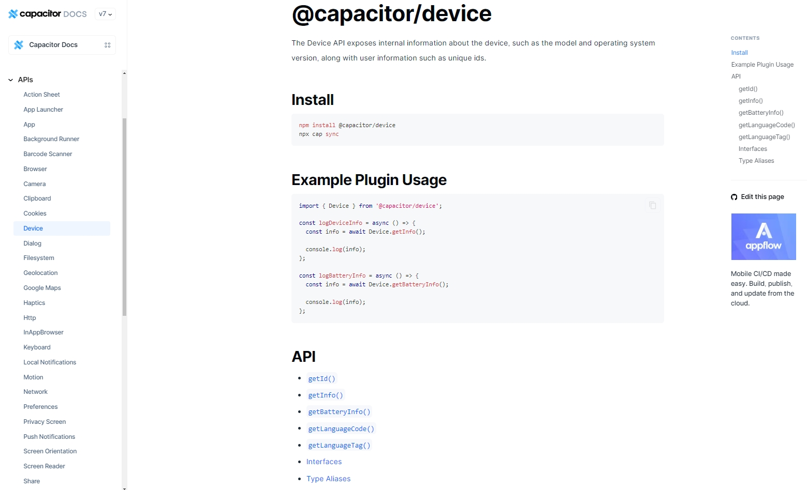

# mobile-demo

基于 Vue3 + Vite6 + TypeScript 开发的移动端项目模板

## 安装使用步骤 📔
* Install
```
pnpm install
```
* Run
```
pnpm dev --host
```
* Build
```
pnpm build
```

## Capacitor

### 使用 **[Capacitor](https://capacitorjs.com/docs/getting-started)** 进行 *Android* 和 *IOS* 项目包创建
###
可以在 ``package.json`` 安装对应的 [capacitor-plugins](https://capacitorjs.com/docs/plugins) 功能插件，以此充分利用原生 API 的全部功能



* 创建
```
1. npx cap init          (生成 capacitor.config.ts 配置文件)

2. npx cap add android   (生成android文件夹)
   npx cap add ios       (生成ios文件夹)

3. 
   3.2 pnpm build        (代码打包)
   3.2 npx cap sync      (同步代码至android/ios文件夹)
```
* 生成安装包
```
* android打包
  Android Studio 打开 android 文件夹，进行 android 打包流程

* ios打包
  Xcode 打开 ios 文件夹，进行 ios 打包流程
```

## Vant UI ⭐

## Tailwindcss字体图标库 🎨

* 字体图标库 **[@iconify-json/material-symbols](https://icon-sets.iconify.design/material-symbols)**

```
<span class="icon-[material-symbols--filter-drama] text-blue-500"></span>
```
